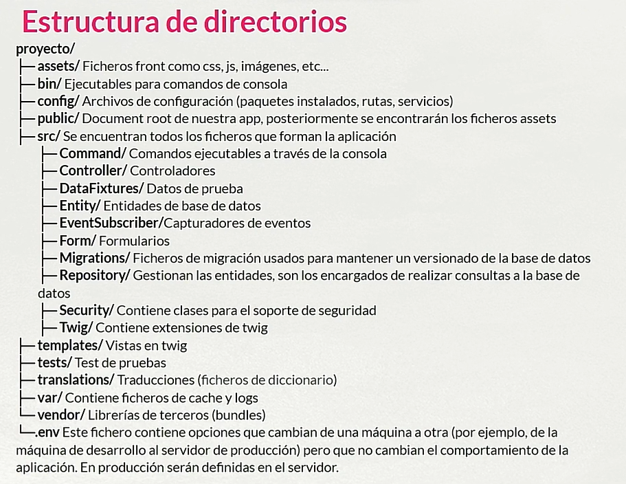
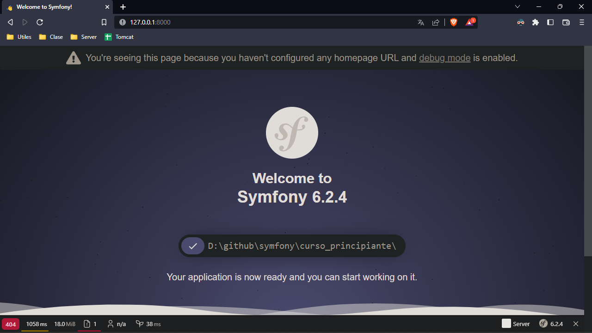

# symfony 5 

# Tabla de contenidos
- [Arrancar un proyecto ya existente](#arrancar-un-proyecto-ya-existente)
- [creacion de un proyecto](#creacion-del-proyecto-e-instalacion-de-componentes)
  - [Crear entidad y repositorio (migration)](#crear-entidad-y-repositorio-migration)
  - [Gestion de la BBDD](#gestion-de-la-bbdd)
  - [generar un controlador](#generar-un-controlador)
  - [Crear un crud](#crear-un-crud)
  - [Usuarios](#usuarios)
    - [Registro](#el-registro)
    - [Login](#el-login)
    - [Roles](#los-roles)
  - [Fechas](#fechas)
  - [Imagenes](#imagenes)
  - [Formularios](#formularios)
  - [Añadir recursos externos para fronted](#añadir-recursos-externos-para-front)
    - [Crear un menu con bootstrap en twig](#crear-un-menu-con-bootstrap)
  - [Paginacion](#paginacion)
    - [Paginacion en twig](#paginacion-en-twig)
  - [Generar datos de prueba](#generar-datos-de-prueba)
- [EasyAdmin](#easyadmin)

La extructura de las directorios  


# Arrancar un proyecto ya existente
Instalamos composer 
```powershell
composer install
```
Generamos nuestro propio archivo.env.local y creamos la base de datos
```powershell
php bin/console doctrine:database:create
```
Ejecutamos todos los fciheros de migracion que tengamos en nuestro sistema
```powershell
php bin/console doctrine:schema:create
```

# Creacion del proyecto e instalacion de componentes
Para crear un nuevo proyecto 
```powershell
symfony new curso_principiante --webapp
```
Una vez instalado accedemos al directorio que nos ha generado, e instalamos maker-bundle que nos permite generar codigo
```powershell
composer require symfony/maker-bundle --dev
```
Instalamos el siguiente bundle, que nos permite utilizar las anotaciones
```powershell
composer require doctrine/annotations
```
Para iniciar el servidor de symfony 
```powershell
symfony server:start
```
Para acceder al servidor nos dirigimos al navegador a traves de la direccion que nos genera http://127.0.0.1:8000


## Crear entidad y repositorio (migration)
Al crear una entidad nos pedira el nombre de la entidad, sus propiedades, tipo, tamaño y si puede ser nulo
```powershell
php bin/console make:entity
```
Simpre que se cree o se modifique una entidad se debe realizar una migracion
```powershell
php bin/console make:migration
```
```powershell
php bin/console doctrine:migrations:migrate
```

## Gestion de la BBDD 
Deberemos modificar el fichero .env, para añadir usuario, contraseña y el nombre de la base de datos quedando de la sigueinte forma
```powershell
DATABASE_URL="mysql://root:@127.0.0.1:3306/curso_principiante?serverVersion=8&charset=utf8mb4"
```
Para crear la base de datos no dirigimos a al simbolo del sistema y ejecutamos el siguiente comando
```powershell
php bin/console doctrine:database:create
```
Una vez creada la base de datos subimos las entidades que tengamos 
```powershell
php bin/console doctrine:schema:create
```
Para eliminar una base de datos
```powershell
php bin/console doctrine:schema:drop
```

## Generar un controlador 
Para generar un controlador. Nos pedira el nombre del controlador y nos genera el controlador y la vista
```powershell
php bin/console make:controller
```

## Crear un crud
La creacion de un crud nos crea tanto los contraladores como las vistas
```powershell
php bin/console make:crud nombre_entidad
```

## Usuarios
Creamos la entidad usuario
```powershell
php bin/console make:user
```
Generamos el crud de la entidad usuario
```powershell
php bin/console make:crud User
```
Debemos modificar el fichero UserType la parte de roles, ya que si no nos dara un fallo de conversion, la clase quedara de la siguiente forma
```php
<?php

namespace App\Form;

use App\Entity\User;
use Symfony\Component\Form\AbstractType;
use Symfony\Component\Form\FormBuilderInterface;
use Symfony\Component\OptionsResolver\OptionsResolver;
use Symfony\Component\Form\Extension\Core\Type\ChoiceType;
use Symfony\Component\Form\CallbackTransformer;

class UserType extends AbstractType
{
    public function buildForm(FormBuilderInterface $builder, array $options): void
    {
        $builder
            ->add('username')
            ->add('Roles', ChoiceType::class, [
                'required' => true,
                'multiple' => false,
                'expanded' => false,
                'choices'  => [
                  'User' => 'ROLE_USER',
                  'Admin' => 'ROLE_ADMIN',
                ],
            ])
            ->add('password');

        // Data transformer
        $builder->get('Roles')
            ->addModelTransformer(new CallbackTransformer(
                function ($rolesArray) {
                     // transform the array to a string
                     return count($rolesArray)? $rolesArray[0]: null;
                },
                function ($rolesString) {
                     // transform the string back to an array
                     return [$rolesString];
                }
        ));
    }

    public function configureOptions(OptionsResolver $resolver): void
    {
        $resolver->setDefaults([
            'data_class' => User::class,
        ]);
    }
}
```
Para seleccionar el uusario actual desde el controlador de la entidad donde queremos que salga el usuario, por ejemplo al crear una nueva tarea para que dicha tarea tenga al usuario por defecto que la crea, en la funcion de new_tarea añadimos esta linea 
```php
$tarea -> setUsuario($security->getUser());
```

### El registro
Para generar el registro de usuarios con su correpondiente vista
```powershell
php bin/console make:registration-form
```
Si queremos personalizar el registro
```php


Registro


<div class="row justify-content-center">
    <div class="col-12 col-md-5">
        <h2 class="text-center pt-5 mb-5">Registro</h2>

        {{ form_start(registrationForm) }}
            <div class="form-group">
                {{ form_label(registrationForm.username) }}
                {{ form_widget(registrationForm.username, {'attr': {'class': 'form-control'}}) }}
            </div>
            <div class="form-group">
                {{ form_label(registrationForm.plainPassword, 'Password') }}
                {{ form_widget(registrationForm.plainPassword, {'attr': {'class': 'form-control'}}) }}
            </div>
            <div class="form-check ml-auto my-3">
                {{ form_widget(registrationForm.agreeTerms, {'attr': {'class': 'form-check-input'} }) }}
                {{ form_label(registrationForm.agreeTerms, '¿Aceptas las condiciones?', {'label_attr': {'class': 'form-check-label'} }) }}
            </div>

            <div class="d-grid">
                <input type="submit" class="btn btn-primary" name="logeo" value="Registrarse">
            </div>
        {{ form_end(registrationForm) }}
    </div>
</div>

```

### El login
Para generar el login 
```powershell
php bin/console make:auth
```
Es importante tener en cuenta que el login nos tiene que redirigir a algun ruta que debemos establecer nosotros en SecurityController o como lo hayamos llamado
```php
    #[Route(path: '/login', name: 'app_login')]
    public function login(AuthenticationUtils $authenticationUtils): Response
    {
        // if ($this->getUser()) {
        //     return $this->redirectToRoute('target_path');
        // }

        // get the login error if there is one
        $error = $authenticationUtils->getLastAuthenticationError();
        // last username entered by the user
        $lastUsername = $authenticationUtils->getLastUsername();

        return $this->render('security/login.html.twig', ['last_username' => $lastUsername, 'error' => $error]);
    }
```
Si queremos personalizar el login
```php


Login


<div class="row justify-content-center">
    <div class="col-12 col-md-5">
        <h2 class="text-center pt-5 mb-5">Bienvenido</h2>
        
        <form method="post">
        
            <div class="alert alert-danger">{{ error.messageKey|trans(error.messageData, 'security') }}</div>
        

        
            <div class="mb-3">
                You are logged in as {{ app.user.userIdentifier }}, <a href="{{ path('app_logout') }}">Logout</a>
            </div>
        

        <div class="mb-4">
            <label for="inputUsername">Username</label>
            <input type="text" value="{{ last_username }}" name="username" id="inputUsername" class="form-control" autocomplete="username" required autofocus>
        </div>
        <div class="mb-4">
            <label for="inputPassword">Password</label>
            <input type="password" name="password" id="inputPassword" class="form-control" autocomplete="current-password" required>
        </div>
        <div class="d-grid">
            <input type="submit" class="btn btn-primary" name="logeo" value="Iniciar sesion">
        </div>
        <div class="my-3">
            <span>¿No tienes cuenta? <a href="{{ path('app_register') }}">Crea tu cuenta</a></span>
        </div>

        <input type="hidden" name="_csrf_token"
            value="{{ csrf_token('authenticate') }}"
        >

        {#
            Uncomment this section and add a remember_me option below your firewall to activate remember me functionality.
            See https://symfony.com/doc/current/security/remember_me.html

            <div class="checkbox mb-3">
                <label>
                    <input type="checkbox" name="_remember_me"> Remember me
                </label>
            </div>
        #}
        </form> 
    </div>
</div>

```

### Los roles
Para denegar el acceso a una funcion en concreto para que sola puedan entrar los admin
```php
$this -> denyAccessUnlessGranted('ROLE_ADMIN');
```
Para no permitir el acceso a una funcion a un usuario que no este registrado
```php
$this -> denyAccessUnlessGranted('ROLE_USER');
```

## Fechas
Cuando queremos dar una fecha podemos dejar la fecha actual como valor por defecto, de esta forma cada vez que creemos un articulo se le asigna la fecha actual, desde el controlador de la entidad
```php
public function __construct() {
    $this -> fecha = new \DateTime();
}
```
Para poder mostar las fhecas debemos darle un formato desde twig
```php
<p class="col-auto">Fecha: {{ articulo.fecha ? articulo.fecha|date('Y-m-d H:i:s') : '' }}</p>
```
Si queremos filtar por la fecha mas reciente podemos crear una funcion en el repositorio, y llamarla desde el controlador
```php
public function findOrderDate(): array
{
    return $this->createQueryBuilder('a')
        ->orderBy('a.fecha', 'DESC')
        ->getQuery()
        ->getResult()
    ;
}
```

## Imagenes
Partimos de una entidad que tenga un campo String, para guardar la imagen, podemos seguir la documentacin de [symfony](https://symfony.com/doc/current/controller/upload_file.html). Lo primero que haremos sera modificar el campo que tenemos desde el formulario para que sea un FileType
```php
use Symfony\Component\Validator\Constraints\File;
use Symfony\Component\Form\Extension\Core\Type\FileType;

->add('imagen', FileType::class, [
    'label' => 'Imagen para el articulo',
    'mapped' => false,
    'required' => false,
    'constraints' => [
        new File([
            'maxSize' => '1024k',
            'mimeTypes' => [
                'image/jpeg',
                'image/png',
            ],
            'mimeTypesMessage' => 'Por favor sube una imagen'
        ])
    ],
])
```
Lo siguiente sera modificar la funcion de creacin de articulo para gestionar la subida de la imagen a la base de datos
```php
use Symfony\Component\HttpFoundation\File\Exception\FileException;
use Symfony\Component\String\Slugger\SluggerInterface;

// Devemos añadir como parametro SluggerInterface $slugger
if ($form->isSubmitted() && $form->isValid()) {

    // Esto debe estar dentro del condicional que valida el formulario
    $imagen = $form->get('imagen')->getData();

    if ($imagen) {
        $originalFilename = pathinfo($imagen->getClientOriginalName(), PATHINFO_FILENAME);

        $safeFilename = $slugger->slug($originalFilename);
        $newFilename = $safeFilename.'-'.uniqid().'.'.$imagen->guessExtension();

        try {
            $imagen->move(
                $this->getParameter('imagen_directory'),
                $newFilename
            );
        } catch (FileException $e) {
            // ... handle exception if something happens during file upload
        }

        $articulo->setImagen($newFilename);
    }
    $articulosRepository->save($articulo, true);

    return $this->redirectToRoute('app_main', [], Response::HTTP_SEE_OTHER);
}
```
Creamos el directorio donde se guardaran las imagenes y creamos el parametro en config/services.yaml
```php
parameters:
    imagen_directory: '%kernel.project_dir%/public/imagenes'
```

## Formularios
Para modifcar un campo de texto a un textArea, desde el formularpio donde este el campo a modificar
```php
use Symfony\Component\Form\Extension\Core\Type\TextareaType;

// ->add('contenido')
->add('contenido', TextareaType::class, [
    'required' => true,
    'attr' => ['rows' => 5]
])
```
Podemos crear una plantilla twig para que todos los formularios tengan los mismos estilos, para ello creamos un fichero en la carpeta comunes llamado _form.html.twig
```php
<div class="row justify-content-center">
    <div class="col-12 col-md-5">
    {{ form_start(form) }}
        
            <div class="form-group">
                {{ form_row(field, {'attr': {'class': 'form-control', 'placeholder': field.vars.label}}) }}
                
                    <div class="invalid-feedback">
                        {{ form_errors(field) }}
                    </div>
                
            </div>
        

        <button type="submit" class="btn btn-primary">Guardar</button>
    {{ form_end(form) }}
    </div>
</div>
```

## Añadir recursos externos para front
Para añadir recursos externos como bootstrap, nos dirigimos a la web oficial y descaargamos  [Bootstrap](https://getbootstrap.com/docs/4.3/getting-started/download/ "Bootstrap") compilado y copiamos los directorios de css y js en el directorio de public  
Una vez copiado realizamos las llamadas desde el archivo base en templates, quedando el archivo de la siguiente forma
```html
<!DOCTYPE html>
<html>
    <head>
        <meta charset="UTF-8">
        <title>Welcome!</title>
        
            <link rel="stylesheet" type="text/css" href="/css/bootstrap.min.css">
        
    </head>
    <body>
        <div class="container">
            
        </div>
        
            <script src="https://code.jquery.com/jquery-3.2.1.slim.min.js" integrity="sha384-KJ3o2DKtIkvYIK3UENzmM7KCkRr/rE9/Qpg6aAZGJwFDMVNA/GpGFF93hXpG5KkN" crossorigin="anonymous"></script>
            <script src="https://cdnjs.cloudflare.com/ajax/libs/popper.js/1.12.9/umd/popper.min.js" integrity="sha384-ApNbgh9B+Y1QKtv3Rn7W3mgPxhU9K/ScQsAP7hUibX39j7fakFPskvXusvfa0b4Q" crossorigin="anonymous"></script>
            <script src="/js/bootstrap.min.js"></script>
        
    </body>
</html>
```
Otra forma de añadir bootstrap es generandolo por node, nos dirigimos al directorio public y ejecutamos el siguiente comando
```powershell
npm i bootstrap@5.3.0-alpha1
```
Creamos el directorio donde iran los estilos, pero usando SASS
```powershell
mkdir scss
```
Creamos un archivo llamado custom.scss y copiamos en el fichero lo siguiente
```css
@import "../node_modules/bootstrap/scss/bootstrap";
```
Una vez hecho esto ya podemos establecer el enlace al directorio css, en el directorio templates
```css
<link rel="stylesheet" type="text/css" href="css/custom.css">
```

### Crear un menu con bootstrap
En el directorio de templates creamos un directorio donde almacenar el menu
```powershell
cd templates
```
```powershell
mkdir comunes
```
Creamos un fichero llamado _menu.html.twig. Una vez ralizado lo incluimos en el fichero base.html.twig de la siguiente forma y creamos un div, quedara de la siguiente forma
```html
<body>
  
  <div class="container">
    
  </div>
</body>
```
Un ejemplo de menu ppodria ser algo asi
```html
<header class="row justify-content-between align-items-center pb-3">
	<h1 class="col-auto"><a class="text-dark nav-link" href="{{ path('app_main') }}">Blog</a></h1>
	<nav class="col-auto navbar-expand">	
		<ul class="navbar-nav ml-auto">
            
			    <li class="nav-item"><a class="nav-link" href="{{ path('app_articulos_new') }}">Crear articulo</a></li>
			
            
                <li class="nav-item"><a class="nav-link" href="{{ path('app_logout') }}">Cerrar sesion</a></li>
            
                <li class="nav-item"><a class="nav-link" href="{{ path('app_login') }}">Login</a></li>
            
		</ul>
	</nav>
</header>
```
Pero tambien podemos buscar algun menu en la pagina de bootstrap

## Paginacion 
Generamos el controlador principal, MainController
```powershell
php bin/console make:controller
```
Debemos crear las funciones correspondientes a la paginacion en el repositorio
```php
public function paginacion($dql, $pagina, $elementosPorPagina) 
{
    $paginador = new Paginator($dql);
    $paginador -> getQuery()
    ->setFirstResult($elementosPorPagina * ($pagina - 1))
    ->setMaxResults($elementosPorPagina);
    return $paginador;
}

public function buscarTodas($pagina = 1, $elementosPorPagina = 5) 
{
  $query = $this->createQueryBuilder('t')
    ->getQuery()
  ;
  return $this -> paginacion($query, $pagina, $elementosPorPagina);
}
```
Y en el maincontroller se veria asi
```php
class MainController extends AbstractController
{
    // Variables
  const ELEMENTOS_POR_PAGINA = 5;

  /**
   *  @Route("/{pagina}", name="app_main", defaults={"pagina": 1}, requirements={"pagina"="\d+"}, methods={"GET"})
   */
  public function index(int $pagina, TareaRepository $tareaRepository): Response
  {
    return $this->render('main/index.html.twig', [
      'tareas' => $tareaRepository -> buscarTodas($pagina, self::ELEMENTOS_POR_PAGINA),
      'pagina' => $pagina,
    ]);
  }
}
```

### Paginacion en twig
Para dar un foramato a la paginacion creamos una sita parcial en templates/comunes "_paginacion.html.twig"
```php






    <nav>
        <ul class="pagination justify-content-center">
            <li class="page-item {{ pagina_actual == 1 ? 'disabled' }}">
                <a class="page-link"
                    href="{{
                        path(nombre_ruta,
                            {
                                pagina: pagina_actual - 1 < 1 ? 1 : pagina_actual - 1
                            }|merge(parametros)
                        ) 
                    }}">
                    <span>&laquo;</span>
                    <span>Anterior</span>
                </a>
            </li>
        

            
                <li class="page-item {{ pagina_actual == i ? 'active' }}">
                    <a class="page-link"
                        href="{{
                            path(nombre_ruta,
                                {
                                    pagina:i
                                }|merge(parametros)
                            ) 
                        }}">
                        <span>{{ i }}</span>
                    </a>
                </li>
            

            <li class="page-item {{ pagina_actual == numero_total_paginas ? 'disabled' }}">
                <a class="page-link"
                    href="{{
                        path(nombre_ruta,
                            {
                                pagina: pagina_actual + 1 <= numero_total_paginas ? pagina_actual + 1 : pagina_actual
                            }|merge(parametros)
                        ) 
                    }}">
                    <span>&raquo;</span>
                    <span>Siguiente</span>
                </a>
            </li>
        </ul>
    </nav>

```
y hacemos la llamada con el include desde donde queremos la paginacion
```php
<div class="mt-3">
  {{ include('comunes/_paginacion.html.twig', {
    elementos_por_pagina: constant('App\\Controller\\MainController::ELEMENTOS_POR_PAGINA'),
    numero_total_elementos: tareas.count,
    pagina_actual: pagina,
  }) }}
</div>
```

## Generar datos de prueba
```powershell
composer require orm-fixtures --dev
```
Nos genera un directorio en src llamado DataFixtures, en el eliminamos el archivo que nos ha generado y generamos el nuestro
```powershell
php bin/console make:fixtures 
```
Creamos un for con los datos a mostrar
```php
for ($i = 0; $i < 20; $i++) { 
  $tarea = new Tarea();
  $tarea -> setDescripcion("Tarea nueva - $i");
  $manager -> persist($tarea);
}
```
y cargamos el archivo
```powershell
php bin/console doctrine:fixtures:load
```

# EasyAdmin
Este es un bundle que nos permitira generar una pagina de administracion muy util
```powershell
composer require easycorp/easyadmin-bundle
```
Generamos un Dashboard, que nos permitra controlar toda la gestion, sera como nuestra pagina principal
```powershell
php bin/console make:admin:dashboard
```
Creamos un crud por cada entidad que tengamos, nos mostrara una lista y estos cruds sera los enalces del menu
```powershell
php bin/console make:admin:crud
```